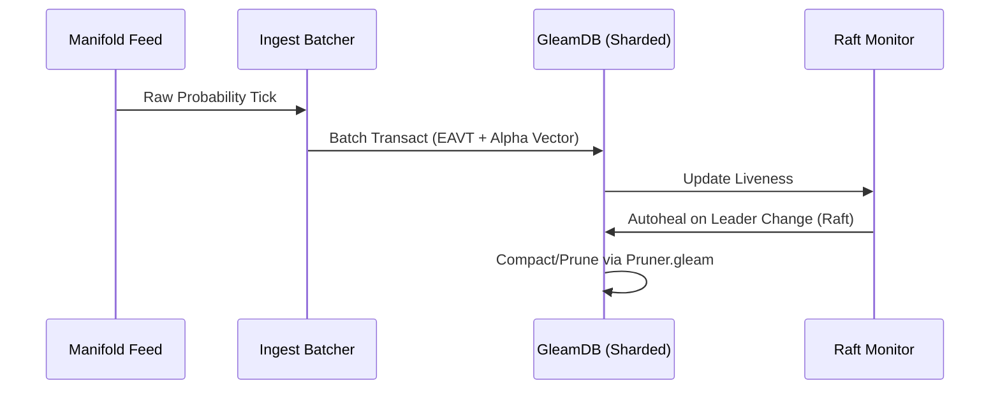

# Gswarm Architecture 🧙🏾‍♂️🐝

Gswarm is designed using the **Rama Pattern** (Write-Optimized Transactional Store + Read-Optimized Indices). It leverages GleamDB's unique ability to de-complect time, logic, and context.

## 🧱 Component Topology

### 1. Sharded Transactor Nodes (`gswarm/node.gleam`)
The fabric is horizontally partitioned into **Logical Shards**. A `ShardedContext` coordinates multiple `gleamdb` instances across parallel OS processes. The `Lean` role collapses shards for resource-efficient local simulation.

### 2. Elastic Ingestion (`gswarm/ingest_batcher.gleam`)
High-throughput ingestion via actor-based batching. Tick data is buffered and flushed as vector-enriched EAVT facts, bypassing serial transactor bottlenecks.

### 3. Raft Consensus & Failover (`gswarm/fabric.gleam`)
Nodes maintain cluster state via a `role_watcher_loop`. If a Leader steps down or fails, the fabric autonomously detects the new Raft leader state and performs **Autohealing**: restarting market tickers and watchers from the durable Mnesia store.

### 4. Probabilistic Intelligence (`gswarm/hll.gleam`, `gswarm/cms.gleam`)
The system maintains O(1) space approximations of:
- **Cardinality**: HyperLogLog for unique market tracking across billions of events.
- **Frequency**: Count-Min Sketch for identifying "hot" market signals in real-time.

---

## 🔄 Data Flow

## 🛡️ Stability & Resilience
- **Resource Awareness**: Lean mode targets the Apple Silicon M2 Pro's efficiency cores.
- **Durable WAL**: Mnesia ensures facts survive process restarts.
- **Active Paging**: `pruner.gleam` maintains a sliding window of historical state to bound RAM usage.
