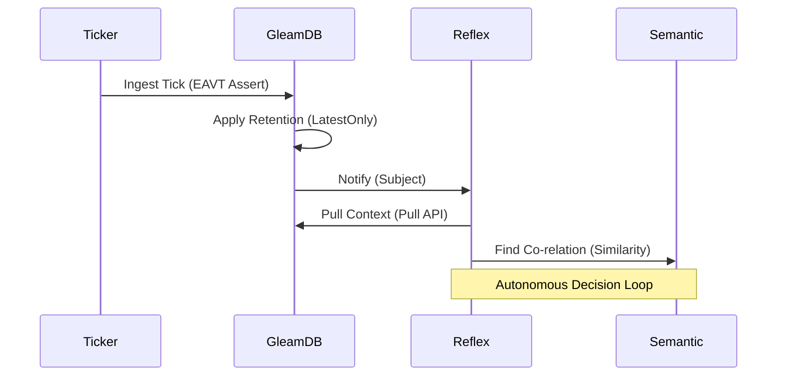

# Gswarm Architecture 🧙🏾‍♂️🐝

Gswarm is designed using the **Rama Pattern** (Write-Optimized Transactional Store + Read-Optimized Indices). It leverages GleamDB's unique ability to de-complect time, logic, and context.

## 🧱 Component Topology

### 1. The Transactor Nodes (`gswarm/node.gleam`)
Nodes boot into active roles (Leader/Follower). The Leader owns the serialized transaction log for a specific Cluster ID, ensuring linearizable consistency across the fabric.

### 2. Silicon Saturation (`gswarm/ticker.gleam`)
The Ticker provides high-frequency data ingestion. It stress-tests GleamDB's ETS-backed indices, achieving sub-millisecond write acknowledgement by bypassing expensive disk IO during simulation.

### 3. Reactive Reflexes (`gswarm/reflex.gleam`)
Subscription actors that derive signal from noise. They use Datalog query subscriptions to watch for complex patterns (e.g., price differentials between independent markets) and trigger autonomous actions.

### 4. Vector Sovereignty (`gswarm/context.gleam`)
The swarm uses Cosine Similarity to understand the semantic proximity of markets. This allows the agent to "cluster" related events (e.g., "AI Progress" vs "Hardware Scalability") without rigid tagging.

## 🔄 Data Flow

## 🛡️ Stability & Resilience
- **Temporal Datalog**: Auditing happens in `analytics.gleam` via `as_of`.
- **Memory Safety**: `market.gleam` configures the swarm to purge fine-grained tick history while preserving core identity facts.
