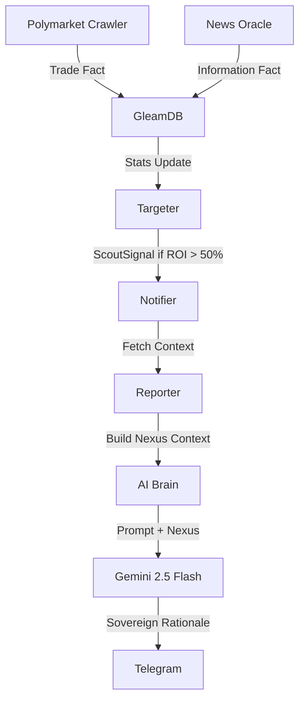

# Gswarm Intelligence Pipeline: Sovereign Forensics

Architectural overview of how Gswarm converts raw market facts into high-alpha Sovereign Intelligence using GleamDB and Gemini 2.5 Flash.

## 🏗️ Data Flow Architecture



## 1. The Ingestion Layer
- **Polymarket Crawler**: Streams real-time trade activity from the CLOB into GleamDB as `TradeFact` entities.
- **News Oracle**: Continuously pulls global financial news and social signals, indexing them temporally in GleamDB.

## 2. The Intelligence Filter (ROI Gating)
Gswarm enforces a strict **50% ROI Floor**. This logic is double-gated to ensure zero noise:
- **Targeter**: Emits a `ScoutSignal` only when a trader's performance metrics exceed the threshold.
- **Notifier**: Performs a final "Iron Gate" check before initiating the expensive AI reasoning cycle.

## 3. The Trade Nexus (Data Recovery)
Before consulting the AI, the **Reporter** constructs a "Trade Nexus". This is a spatio-temporal join that recovers the information environment present at the time of each trade.

```gleam
// Logic: Fetch news items where (News.timestamp <= Trade.timestamp)
fn build_nexus_context(db: gleamdb.Db, stats: Stats) -> String {
  // Performance Summary + Correlated Trade/News pairs
}
```

## 4. Sovereign Rationale (Gemini 2.5 Flash + Search Grounding)
The AI Brain uses **Gemini 2.5 Flash** equipped with active **Google Search Grounding** to perform forensic analysis on the Nexus. It avoids simple summarization, focusing instead on deterministic success factors:

- **Forensic Verification**: Cross-references trade timestamps with real-time news archives using active search queries.
- **Edge Identification**: Why is this trader winning? (e.g., info timing, momentum capture).
- **Signal Depth**: Is there a provable information advantage (<15m lead on news)?
- **Brevity Floor**: Reports are capped at 4000 characters for reliable Telegram delivery.

## 5. Delivery
Intelligence is delivered via Telegram using sanitized HTML formatting, ensuring high-fidelity rendering of forensic insights without parsing errors.
