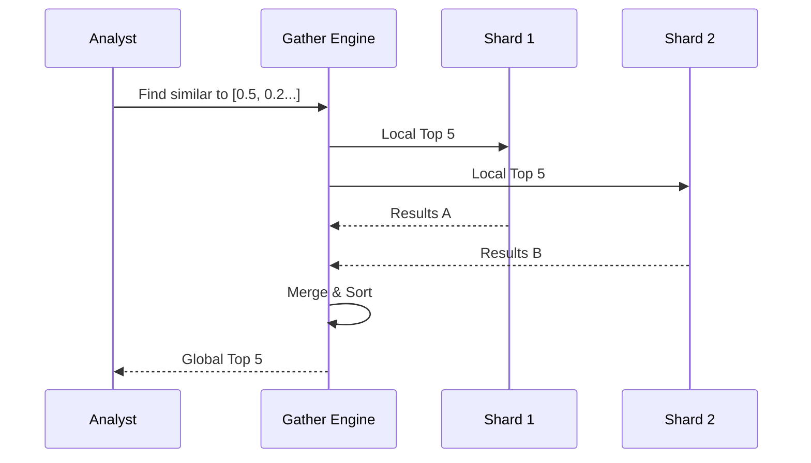

# PRD: Distributed V-Link (Phase 50) 🔗🌍

**Status**: Draft  
**Priority**: P1  
**Owner**: Rich Hickey 🧙🏾‍♂️

## Overview
Currently, `context.gleam` and `semantic.gleam` provide vector similarity search, but they operate per-shard or in a localized manner. **Phase 50** implements a **Distributed V-Link** that allows the Gather Engine (Phase 40) to execute semantic similarity searches across ALL leaders, returning the globally "most similar" historical regimes.

---

## 1. Deep Assessment (Rich Hickey Analysis)
- **Constraint**: Network latency between shards.
- **Problem**: Similarity scores are relative. We need a "Global Top K."
- **Solution**: Scatter-Gather for Vectors. Each shard returns its Top K, the Gatherer merges and re-sorts.

---

## 2. User Stories
- **As an Analyst**, I want to find the most similar historical vector *anywhere* in the swarm, not just in the current shard's market set.

---

## 3. Acceptance Criteria (Rich Hickey Gherkin)
### Path: Global Similarity Search
**Given** a cluster of 4 shards  
**When** a similarity search is performed for Vector V  
**Then** the result set must contain the Top 5 most similar ticks from the *entire* cluster's historical data.

---

## 4. Technical Implementation

### API: `sharded_query.gleam` [MODIFY]
- Add `vector_search(db, query_vector, k: Int) -> List(VectorMatch)`
- This function will broadcast the search to all shard PIDs.

### Aggregation logic
- Map-Reduce pattern:
  - **Map**: Shards compute local cosine similarity.
  - **Reduce**: Aggregator collects `#(distance, id)` tuples and sorts them.

---

## 5. Visual Architecture

---

## 6. Pre-Mortem: "Why will this fail?"
- **Skewed Data**: One shard might have all the high-quality matches, but we only ask for K from each.
  - *Mitigation*: Request slightly more (e.g., 2*K) from each shard to ensure we don't miss the tails.

---

PRD Drafted. Initiate the Autonomous Pipeline: /proceed docs/specs/distributed_v_link.md -> /test -> /refactor -> /test
