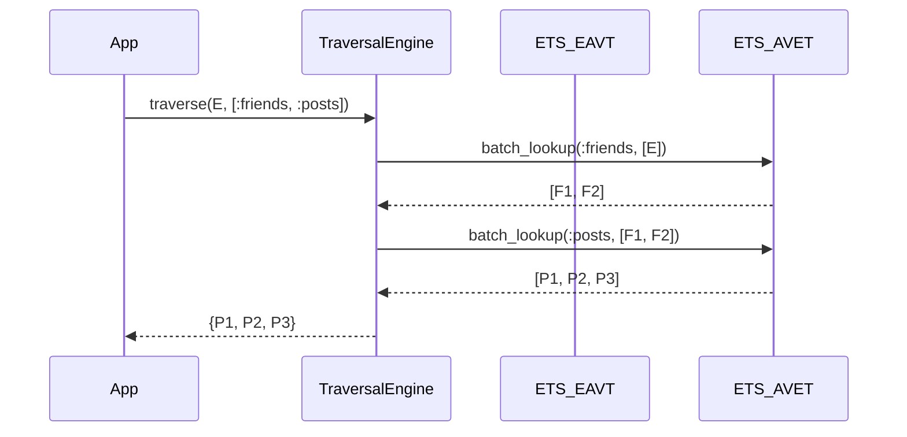

# Constrained Graph Traversal DSL for GleamDB

## Overview
Based on the gap analysis between GleamDB and SurrealDB, we identified that SurrealDB's first-class graph edge relationships (`<-`, `->`) provide immense utility for interconnected data. However, adopting SurrealDB violates the principle of simplicity by complecting storage paradigms. To achieve the utility without the complexity, GleamDB will introduce a **Constrained Graph Traversal DSL**. This DSL will compile down to native Datalog queries over our existing, immutable EAVT index, providing simple, fast, and composable graph pathfinding directly inside the BEAM without altering the underlying storage mechanics.

## Deep Assessment & Simulation
* **Hostile Security Auditor:** Traversal queries can lead to aggressive algorithmic complexity (e.g., recursive depth bombs) causing BEAM scheduler starvation. The DSL must have strict, statically verifiable depth limits and timeout boundaries.
* **SRE Perspective:** Recursive pathfinding over large EAVT clusters could result in unbounded message passing during index joins. We must enforce zero-copy struct mappings for traversals and push computation to the node owning the ETS shard where possible.
* **Assumptions:** We assume GleamDB's core EAVT index is stable. We assume applications need to express complex relationship chains (e.g., `User -> friends -> posts <- likes`).
* **Simulation Limitations:** A deep graph traversal over cold (spilled) disk data could ruin latency. The DSL should optionally enforce "memory-only" traversal boundaries.

## User Stories
* **As a** backend developer, **I want** to specify entity traversals using a concise string DSL (e.g., `[:friends :posts]`) **So that** I don't have to manually write recursive map/fold logic or verbose Datalog ASTs.
* **As an** AI agent layer, **I want** to query the shortest path between my memory contexts using the DSL **So that** I can retrieve contextual sub-graphs efficiently.
* **As a** database operator, **I want** graph queries to abort predictably if they exceed a specific depth or elapsed time **So that** the system remains highly available and predictable.

## Acceptance Criteria
* **Given** a graph traversal DSL query `[:user/friends :user/posts]` starting from `Entity A`
  **When** executed against the GleamDB engine
  **Then** the engine successfully resolves all posts created by the friends of `Entity A` in a single pass.
* **Given** a recursive DSL query with unbounded depth
  **When** parsed by the engine
  **Then** the engine rejects the query with a strict `DepthLimitExceeded` error prior to execution.
* **Given** a traversal query running on the ETS fast-path
  **When** it traverses more than the `zero_copy_threshold`
  **Then** it returns the results as a serialized `PullRawBinary` payload.

## Technical Implementation

### Database Model Updates
No underlying changes to the EAVT index. Traversals will translate purely to lookups against the existing `A` (Attribute) and `V` (Value) indices.

### New Types
```gleam
pub type TraversalStep {
  Out(attribute: String)  // Translates to ->
  In(attribute: String)   // Translates to <-
}

pub type TraversalExpr = List(TraversalStep)
```

### API Endpoints (Gleam Level)
```gleam
// Resolves a DSL string or List(TraversalStep) over an EntityId
pub fn traverse(
  db: Db, 
  eid: fact.Eid, 
  expr: TraversalExpr, 
  max_depth: Int
) -> Result(List(fact.Value), String)
```

### Data Flow
1. **Application** calls `gleamdb.traverse(db, eid, [Out("friends"), In("likes")])`.
2. **DSL Parser** validates the expression length against `max_depth`.
3. **Execution Engine** fetches `eid` values for the first step via ETS `get_av`.
4. **Recursive Step** batches the resulting entity IDs and performs concurrent ETS lookups for the next step, avoiding N+1 lookup latency by utilizing `_tidewave.ai/gleam/fact/sync` clustered reads.
5. **Yield** returns the flattened unique set of target entities.

## Visual Architecture


## Security & Validation
* **Depth Guards:** Hardcoded limits (e.g., Max Recursion = 5) enforced during query validation.
* **Runtime Aborts:** Timeouts applied via `erlang:yield()` checks between deep traversal steps to ensure the BEAM scheduler is not blocked.
* **Input Validation:** DSL Strings must match strict alphanumeric attribute requirements. No dynamic/eval execution.

## Pre-Mortem Analysis
* **Why will this fail?** A "supernode" (an entity with millions of edges) could cause an Out-of-Memory (OOM) crash during traversal expansion.
* **Mitigation:** Introduce pagination or a strict `LIMIT` clause per traversal hop to prevent combinatorial explosion. (e.g. `[:friends LIMIT 100, :posts LIMIT 10]`).

---

## Implementation Notes (Completed 2026-02-20)

### Types Added
- `TraversalStep` (`Out(String)` / `In(String)`) and `TraversalExpr` in [types.gleam](file:///Users/brixelectronics/Documents/mac/gswarm/src/gleamdb/shared/types.gleam).

### API
- `gleamdb.traverse(db, eid, expr, max_depth)` in [gleamdb.gleam](file:///Users/brixelectronics/Documents/mac/gswarm/src/gleamdb.gleam).

### Engine
- `engine.traverse` + recursive `do_traverse` in [engine.gleam](file:///Users/brixelectronics/Documents/mac/gswarm/src/gleamdb/engine.gleam).
- `Out` resolves via EAVT entity→attribute→value (chasing `Ref` values).
- `In` resolves via AEVT reverse lookup (finding entities whose attribute points at the current ID).
- Depth guard rejects expressions longer than `max_depth` with `DepthLimitExceeded`.

### Tests
- [graph_traversal_test.gleam](file:///Users/brixelectronics/Documents/mac/gswarm/test/gleamdb/graph_traversal_test.gleam) — 1-hop, 2-hop, 3-hop (mixed Out/In), and depth rejection.
- All 125 tests passing.

