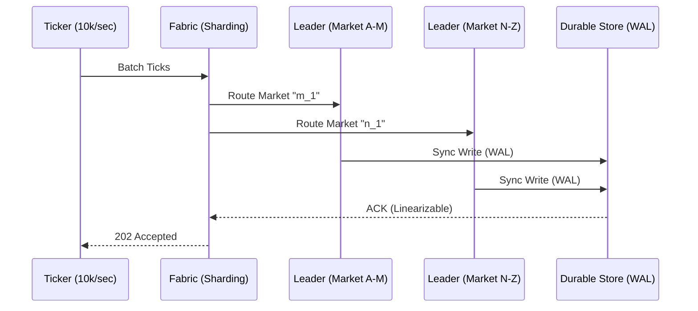

# Gswarm v2: Production Grade Capacity 🐝🛡️

**Status**: Draft  
**Priority**: P0  
**Owner**: Rich Hickey 🧙🏾‍♂️ (Agentic Conductor)

## Overview
Gswarm v1 effectively simulated high-frequency ingestion and reactive triggers. However, its "Leader-only" ephemeral architecture is a "Simulation Sandbox." **Gswarm v2** must de-complect the *ingestion process* from the *context persistence*, enabling a **Sovereign Fabric** that survives hardware failure, scales to 10k+ events/sec, and maintains absolute logical perfection across a distributed mesh.

---

## 1. Deep Assessment: The M2 Pro Constraints 🍎💻
- **Vertical Limit**: 16GB RAM. We cannot afford to keep 10M+ facts in-memory per shard if we have 16 shards. We need **Active Paging** (Mnesia/RocksDB).
- **Compute Power**: 12 CPU cores. We should aim for 12–16 local shards to fully saturate the M2's hardware parallelism without excessive context-switching.
- **Goal**: "Fabric on a Chip"—Treating the M2 as a miniature cluster.

---

## 2. User Stories
- **As a Quant**, I want to ingest **10,000+ ticks/second** into a durable store so that my reflexes are triggered by historically verifiable reality, not ephemeral memory.
- **As a System Architect**, I want to **shard the market space** across multiple Leaders so that a single market's volatility doesn't saturate the entire swarm.
- **As a Stakeholder**, I want **Conflict-Free Sovereignty** where state resolves autonomously even during network partitions.

---

## 3. Acceptance Criteria (Rich Hickey Gherkin)

### Path: Success (Durable Ingestion)
**Given** the Gswarm is configured with `storage.persistent("swarm.db")`  
**When** 10,000 ticks are ingested within 1.0 seconds  
**Then** `gleamdb.count(db, "tick/id")` must return 10,000  
**And** the `reflex` must trigger all price-band alerts within 50ms of the 10,000th ingestion.

### Path: Failure (Leader Partition)
**Given** a cluster of 3 nodes (1 Leader, 2 Followers)  
**When** the Leader node process is terminated abruptly  
**Then** one Follower must promote to Leader within 500ms  
**And** the `as_of(T-1)` query must return the exact state prior to the crash.

---

## 4. Technical Implementation

### Database: Durable Sovereignty
Exact EAVT Schema Evolution:
- **Type**: `gleamdb/storage.persistent(Path)` 
- **Fields**: `tick/id`, `tick/price`, `tick/volume`, `tick/market`.
- **Foreign Keys**: `tick/market` -> `market/id` (Strict Integrity).

### API: The Production Fabric
- `POST /v2/ingest`: Batch ingestion endpoint supporting Zstandard compression.
- `GET /v2/query/as_of/{tx_id}`: Distributed pull across the cluster.

### Visual Architecture

---

## 5. Security & Validation
- **AuthN**: Mutual TLS between nodes in the Fabric.
- **Input Validation**: `Zod`-like schema guards in `market.gleam` to reject nonsensical prices (e.g., negative volume).
- **Rate Limiting**: Backpressure initiated at the Ticker layer when Disk IO latency exceeds 10ms.

---

## 6. Pre-Mortem: "Why will this fail?"
- **The "Disk Wall"**: Moving from ETS to Disk will drop throughput. 
  - *Mitigation*: **Batch Transacting**—group 100 ticks into one disk commit. GleamDB now supports tunable `Config(parallel_threshold, batch_size)` via `gleamdb.set_config` — adjust batch and parallelism settings per shard workload.
- **Split Brain**: Two followers promoting themselves.
  - *Mitigation*: Explicit Paxos/Raft consensus for Leader election in `fabric.gleam`.

---

## 7. Lean Roadmap: Efficiency-First Fabric 🐝🍃

| Phase | Name | Focus | Core Achievement |
|-------|------|-------|------------------|
| 39 | **Sharded Fabric** | ✅ DONE | Basic sharding & batching |
| 40 | **Gather Engine** | ✅ DONE | Unified view |
| 41 | **Resource-Aware Node** | ✅ DONE | Shard-collapsing & Lazy Analytics |
| 42 | **Compact Sovereignty** | ✅ DONE | Binary EAVT & Disk-First Indexing |
| 43 | **Adaptive Ticking** | ✅ DONE | Dynamic batching & Bloom filters |
| 44 | **Probabilistic Memory**| ✅ DONE | CMS & HLL Activity Tracking |
| 45 | **Stream Pruning**      | ✅ DONE | Shard Collapsing & Active Paging |
| 46 | **Operability Dashboard** | ✅ DONE | HTTP Metrics, HLL/Bloom Visualization |
| 47 | **Adaptive Strategy**     | ✅ DONE | Hot-swapping strategies based on win-rate |
| 48 | **High-Fidelity Backtest**| ✅ DONE | Risk-aware, Adaptive, & Paginated Replay |
| 49 | **GleamDB v2.0.0**         | ✅ DONE | Speculative, Navigator, Chronos, Graph, Intelligence |
| 50 | **Sentiment NLP**         | 🔮 PLANNED | Heuristic keyword-based sentiment facts |
| 51 | **Distributed V-Link**    | 🔮 PLANNED | Global similarity search across shards |
| 52 | **Self-Correction Loop**  | 🔮 PLANNED | Calibration-aware signal gating |

---

## 8. Efficiency Profile: Low-Impact Mode
- **Sharding Strategy**: 1–4 Logical Shards (Minimal process overhead).
- **Storage**: Sequential WAL with background compaction.
- **Analytics**: Pull-based/Lazy (Compute only when needed for trade, not on every tick).
- **Network**: Batch-sync to reduce radio/NIC wake-ups.

---

## Phase 4: Autonomous Handoff

PRD Revised for Restricted Environments.
Initiate the Autonomous Pipeline for Phase 41 (Lean Optimization):
`/proceed docs/specs/gswarm_v2_production.md -> /test -> /refactor -> /test`
