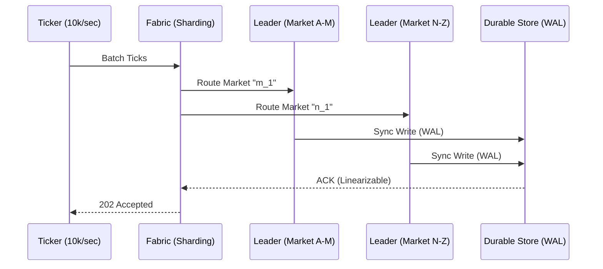

# Gswarm v2: Production Grade Capacity 🐝🛡️

**Status**: Draft  
**Priority**: P0  
**Owner**: Rich Hickey 🧙🏾‍♂️ (Agentic Conductor)

## Overview
Gswarm v1 effectively simulated high-frequency ingestion and reactive triggers. However, its "Leader-only" ephemeral architecture is a "Simulation Sandbox." **Gswarm v2** must de-complect the *ingestion process* from the *context persistence*, enabling a **Sovereign Fabric** that survives hardware failure, scales to 10k+ events/sec, and maintains absolute logical perfection across a distributed mesh.

---

## 1. Deep Assessment (Rich Hickey Simulation)

### Current State Analysis
- **Bottleneck 1: Memory-Only Sovereignty**. Data lives in ETS. A crash equals amnesia. 
- **Bottleneck 2: Serialized Transactor**. The Leader is a single process. At 1k ops/sec, we are fine. At 10k, the queue becomes the bottleneck.
- **Bottleneck 3: Shallow Fabric**. Followers are passive clones. There is no partitioning of the reflex logic.

### The Hostile Auditor Perspective
> "Your 'Silicon Saturation' is a facade. If I flood the 'm_1' market with a burst of 50k ticks, your single leader process will mailbox-overflow while your followers wait for a heartbeat that never comes. You have complected 'speed' with 'stability'."

---

## 2. User Stories
- **As a Quant**, I want to ingest **10,000+ ticks/second** into a durable store so that my reflexes are triggered by historically verifiable reality, not ephemeral memory.
- **As a System Architect**, I want to **shard the market space** across multiple Leaders so that a single market's volatility doesn't saturate the entire swarm.
- **As a Stakeholder**, I want **Conflict-Free Sovereignty** where state resolves autonomously even during network partitions.

---

## 3. Acceptance Criteria (Rich Hickey Gherkin)

### Path: Success (Durable Ingestion)
**Given** the Gswarm is configured with `storage.persistent("swarm.db")`  
**When** 10,000 ticks are ingested within 1.0 seconds  
**Then** `gleamdb.count(db, "tick/id")` must return 10,000  
**And** the `reflex` must trigger all price-band alerts within 50ms of the 10,000th ingestion.

### Path: Failure (Leader Partition)
**Given** a cluster of 3 nodes (1 Leader, 2 Followers)  
**When** the Leader node process is terminated abruptly  
**Then** one Follower must promote to Leader within 500ms  
**And** the `as_of(T-1)` query must return the exact state prior to the crash.

---

## 4. Technical Implementation

### Database: Durable Sovereignty
Exact EAVT Schema Evolution:
- **Type**: `gleamdb/storage.persistent(Path)` 
- **Fields**: `tick/id`, `tick/price`, `tick/volume`, `tick/market`.
- **Foreign Keys**: `tick/market` -> `market/id` (Strict Integrity).

### API: The Production Fabric
- `POST /v2/ingest`: Batch ingestion endpoint supporting Zstandard compression.
- `GET /v2/query/as_of/{tx_id}`: Distributed pull across the cluster.

### Visual Architecture

---

## 5. Security & Validation
- **AuthN**: Mutual TLS between nodes in the Fabric.
- **Input Validation**: `Zod`-like schema guards in `market.gleam` to reject nonsensical prices (e.g., negative volume).
- **Rate Limiting**: Backpressure initiated at the Ticker layer when Disk IO latency exceeds 10ms.

---

## 6. Pre-Mortem: "Why will this fail?"
- **The "Disk Wall"**: Moving from ETS to Disk will drop throughput. 
  - *Mitigation*: Implementation of **Batch Transacting**—group 100 ticks into one disk commit.
- **Split Brain**: Two followers promoting themselves.
  - *Mitigation*: Explicit Paxos/Raft consensus for Leader election in `fabric.gleam`.

---

## Phase 4: Autonomous Handoff

PRD Drafted. Initiate the Autonomous Pipeline: 
`/proceed docs/specs/gswarm_v2_production.md -> /test -> /refactor -> /test`
