# PRD: Prediction Markets Intelligence — Phases 34–38

**Status**: Draft  
**Priority**: P0  
**Owner**: Rich Hickey 🧙🏾‍♂️ (Agentic Conductor)

---

## Overview

Phases 29–33 built the **adaptive intelligence stack**: strategy selection, real vectors, volume intelligence, risk gating, and temporal patterns. But the system operates exclusively on **crypto spot prices** — it tracks BTC/ETH/SOL as linear price feeds.

The `Market` type already has `question` and `outcomes` fields. The `Tick` type has an `outcome` field. Yet every tick sets `outcome: "Yes"` and tracks spot price. **The prediction market infrastructure exists but is dormant.**

This roadmap activates it. We refocus the entire intelligence stack on **event outcome probabilities** — binary and multi-outcome markets where price represents probability (0.0–1.0), markets resolve to specific outcomes, and the system's job is to predict probability movements and score its own calibration.

| Phase | Name | Core Question |
|-------|------|---------------|
| 34 | **Prediction Market Data Model** | What IS a prediction market in our system? |
| 35 | **Live Market Feed** | Where does real probability data come from? |
| 36 | **Outcome Probability Analyst** | Can we predict probability movements? |
| 37 | **Market Resolution & Settlement** | How do we score ourselves against truth? |
| 38 | **Cross-Market Intelligence** | How do markets influence each other? |

```mermaid
graph TD
    A["Phase 33 ✅ Temporal"] --> B["Phase 34: Data Model"]
    B --> C["Phase 35: Live Feed"]
    B --> D["Phase 36: Probability Analyst"]
    C --> D
    D --> E["Phase 37: Resolution"]
    C --> F["Phase 38: Cross-Market"]
    E --> G["🎯 Calibrated Alpha"]
    F --> G
```



---

## 1. Deep Assessment (Hostile Auditor)

### Current Gaps

| Gap | Impact | Severity |
|-----|--------|----------|
| `Tick.outcome` always `"Yes"` | Multi-outcome markets impossible | **Critical** |
| `Tick.price` represents USD spot, not probability | No concept of probability space [0.0, 1.0] | **Critical** |
| No market resolution/expiry | Markets never resolve — no ground truth | High |
| No Brier score or calibration | Cannot measure if predictions are accurate | High |
| Feed is Coinbase-only (spot crypto) | No real prediction market data | High |

### The Hostile Auditor Speaks

> "Your `Market` type was designed for prediction markets — it has `question` and `outcomes`. Your `Tick` has an `outcome` field. But you set outcome to `"Yes"` on every tick and track USD spot prices. You built a prediction market skeleton and filled it with a crypto ticker. The types are lying."

---

## 2. User Stories

- **As a Quant**, I want to track real prediction market probabilities so that I can analyze outcome likelihood across political, crypto, and sports events.
- **As an Analyst**, I want to predict probability movements using the Alpha vector so I can identify mispriced outcomes before the market corrects.
- **As a Risk Manager**, I want resolved market data to compute Brier scores so I can measure whether my system's probability estimates are actually calibrated.
- **As a Researcher**, I want to correlate movements across prediction markets so I can find alpha in cross-market signals.

---

## 3. Phase Details

### Phase 34: Prediction Market Data Model

**Problem**: `Market` and `Tick` types conflate prediction markets with spot price feeds. No concept of probability, resolution, or multi-outcome structure.

**Solution**: Refactor the data model to be prediction-market-native.

#### Technical Design

```gleam
// market.gleam [MODIFY]
pub type MarketType {
  Binary         // Yes/No (probability 0.0–1.0)
  MultiOutcome   // N outcomes, probabilities sum to 1.0
  Scalar         // Numeric range prediction
}

pub type MarketStatus {
  Open
  Closed
  Resolved(winning_outcome: String)
}

pub type Market {
  Market(
    id: String,
    question: String,
    outcomes: List(String),
    market_type: MarketType,
    status: MarketStatus,
    close_time: Int,          // Unix timestamp
    source: String            // "manifold", "polymarket", etc.
  )
}

pub type Tick {
  Tick(
    market_id: String,
    outcome: String,          // NOW MEANINGFUL: "Yes", "No", "Trump", etc.
    probability: Float,       // 0.0–1.0 (THIS IS THE PRICE)
    volume: Int,
    timestamp: Int
  )
}
```

#### Acceptance Criteria

**Given** a binary market with outcomes `["Yes", "No"]`  
**When** a tick is ingested with `outcome: "Yes"` and `probability: 0.65`  
**Then** the stored probability for "No" is automatically derived as `0.35`  
**And** `Tick.probability` is validated to be in `[0.0, 1.0]`

---

### Phase 35: Live Market Feed (Manifold Markets API)

**Problem**: The only data source is Coinbase spot prices. No prediction market data enters the system.

**Solution**: Add a `market_feed.gleam` module that polls the Manifold Markets API (free, no auth required).

#### API Details

```
GET https://api.manifold.markets/v0/markets?limit=20&sort=liquidity
GET https://api.manifold.markets/v0/market/{id}
GET https://api.manifold.markets/v0/market/{id}/positions
```

Response shape:
```json
{
  "id": "abc123",
  "question": "Will BTC exceed $120K by March 2026?",
  "outcomes": ["YES", "NO"],
  "probability": 0.42,
  "volume": 15000,
  "closeTime": 1709251200000,
  "isResolved": false,
  "resolution": null
}
```

#### Technical Design

```gleam
// market_feed.gleam [NEW]
pub fn start_market_feed(db: Db, market_ids: List(String)) -> Nil
// Polls each market every 15s, ingests probability ticks

fn fetch_market(market_id: String) -> Result(ManifoldMarket, String)
// GET /v0/market/{id} → decode → Tick

fn decode_manifold_market(json: String) -> Result(ManifoldMarket, String)
// Decode JSON to MarketFeedResult

pub type ManifoldMarket {
  ManifoldMarket(
    id: String,
    question: String,
    probability: Float,
    volume: Int,
    close_time: Int,
    is_resolved: Bool,
    resolution: Option(String)
  )
}
```

#### Acceptance Criteria

**Given** a valid Manifold market ID  
**When** the feed polls the API  
**Then** a `Tick` is ingested with `probability` in `[0.0, 1.0]`  
**And** the Alpha vector is computed from probability history (not USD price)

---

### Phase 36: Outcome Probability Analyst

**Problem**: The Analyst predicts "up" or "down" on spot price. It needs to predict probability movement on prediction market outcomes.

**Solution**: Refactor the analyst to work in probability space.

#### Technical Design

```gleam
// analyst.gleam [MODIFY]
// Predictions become probability-aware:
// Instead of "price will go up" → "probability will increase/decrease"
// Confidence = fractal match count + temporal alignment

fn loop(db: Db, market_id: String) {
  // 1. Get latest probability vector (not price vector)
  // 2. Find similar historical probability patterns
  // 3. Predict probability direction with magnitude
  // 4. Record prediction with current probability for future scoring
}

// result_fact.gleam [MODIFY]
// Store predicted_probability and actual_probability for Brier scoring
pub fn record_probability_prediction(
  db: Db,
  market_id: String,
  predicted_direction: String,
  current_probability: Float,
  predicted_probability: Float
) -> Result(DbState, String)
```

#### Acceptance Criteria

**Given** a binary market at probability 0.42  
**When** the Analyst finds 5+ historical fractals where similar probability vectorhad increased  
**Then** it predicts "probability_up" with `predicted_probability: 0.48`  
**And** the prediction is recorded for future Brier scoring

---

### Phase 37: Market Resolution & Settlement

**Problem**: Markets never resolve. There is no ground truth to score against.

**Solution**: 
1. Poll Manifold for resolution status
2. When a market resolves, settle all paper positions
3. Compute Brier score: `(predicted_probability - actual_outcome)²`

#### Technical Design

```gleam
// resolution.gleam [NEW]
pub type Resolution {
  Resolution(
    market_id: String,
    winning_outcome: String,
    resolved_at: Int,
    brier_score: Float        // Lower is better. 0.0 = perfect calibration
  )
}

pub fn check_resolution(db: Db, market_id: String) -> Result(Option(Resolution), String)
// Polls Manifold API for resolution status

pub fn settle_market(db: Db, market_id: String, resolution: Resolution) -> Result(DbState, String)
// 1. Mark market as Resolved
// 2. Settle paper trader positions (winning outcome = $1, losing = $0)
// 3. Compute Brier score for all predictions on this market
// 4. Store resolution facts

pub fn brier_score(predicted: Float, actual: Float) -> Float
// (predicted - actual)² — pure function, no side effects

pub fn calibration_report(db: Db) -> List(#(String, Float))
// Returns [(market_id, avg_brier_score)] for all resolved markets
```

#### Acceptance Criteria

**Given** a market that the system predicted at 0.70 probability for "Yes"  
**When** the market resolves to "Yes" (actual = 1.0)  
**Then** Brier score = (0.70 - 1.0)² = 0.09  
**And** paper positions in "Yes" receive $1.00 per share  
**And** paper positions in "No" receive $0.00 per share

---

### Phase 38: Cross-Market Intelligence

**Problem**: Markets don't exist in isolation. "Will BTC hit $120K?" and "Will the Fed cut rates?" are correlated. The system treats each market independently.

**Solution**: Correlate probability movements across markets.

#### Technical Design

```gleam
// cross_market.gleam [NEW]
pub fn compute_market_correlation(
  db: Db,
  market_a: String,
  market_b: String
) -> Float
// Pearson correlation of probability time series

pub fn find_leading_indicators(db: Db, target_market: String) -> List(#(String, Float))
// Which other markets' probability changes predict this market's movement?
// Returns [(market_id, correlation_coefficient)]

pub fn start_cross_market_scanner(db: Db) -> Nil
// Periodically compute pairwise correlations across all tracked markets
// Store as correlation facts for the strategy selector
```

#### Acceptance Criteria

**Given** two markets with 50+ overlapping probability ticks  
**When** `compute_market_correlation` runs  
**Then** it returns a Pearson coefficient in `[-1.0, 1.0]`  
**And** markets with |correlation| > 0.7 are flagged as "linked"

---

## 4. Security & Validation

- **Probability Bounds**: All probabilities MUST be clamped to `[0.0, 1.0]` — no exceptions
- **Resolution Immutability**: Once a market resolves, it CANNOT be un-resolved
- **API Rate Limiting**: Manifold API has no hard rate limit but be respectful — max 1 req/15s per market
- **No Real Money**: Paper trader operates on virtual capital only. No API keys to real exchanges

---

## 5. Pre-Mortem: "Why will this fail?"

| Risk | Probability | Mitigation |
|------|-------------|------------|
| **Manifold API changes** | Medium | Abstract behind `market_feed` interface; fallback to cached data |
| **Thin markets**: Low-volume markets have noisy probabilities | High | Filter by minimum volume/liquidity threshold before tracking |
| **Brier score gaming**: System could predict 0.50 on everything for acceptable scores | Low | Track sharpness metric (how far predictions deviate from 0.50) |
| **Cross-market spurious correlations** | Medium | Require minimum 50 overlapping ticks; use rolling window, not all-time |
| **Market type mismatch**: Refactoring Tick.price→probability breaks crypto feed | High | Keep `live_ticker.gleam` for crypto; new `market_feed.gleam` for prediction markets |

---

## 6. Execution Order (Dependencies)

```
Phase 34 (Data Model) → Phase 35 (Feed) → Phase 36 (Analyst)
Phase 35 (Feed)       → Phase 37 (Resolution)
Phase 36 (Analyst)    → Phase 37 (Resolution)
Phase 35 (Feed)       → Phase 38 (Cross-Market)
```

**Recommended sequence**: 34 → 35 → 36 → 37 → 38

Phase 34 unblocks everything by making the type system honest.

---

## 7. Modules Affected

| Module | Change | Impact |
|--------|--------|--------|
| `market.gleam` | Add `MarketType`, `MarketStatus`, refactor `Tick` | **Breaking** — all consumers update |
| `market_feed.gleam` | **NEW** — Manifold Markets API client | Non-breaking |
| `analyst.gleam` | Probability-aware predictions | Moderate |
| `result_fact.gleam` | Store predicted/actual probability for Brier | Moderate |
| `resolution.gleam` | **NEW** — market resolution + settlement | Non-breaking |
| `cross_market.gleam` | **NEW** — pairwise market correlation | Non-breaking |
| `paper_trader.gleam` | Trade outcome shares ($0–$1) instead of crypto | **Breaking** |
| `live_ticker.gleam` | Preserved — crypto feed remains parallel | Non-breaking |
| `risk.gleam` | Adapt position sizing for probability space | Moderate |
| `strategy.gleam` | Strategies operate on probability vectors | **Breaking** |

---

## Verification Plan

### Automated Tests
```bash
gleam build
gleam test
```

### Live Verification
- `gleam run` — observe log output for Manifold market probability ticks
- Confirm Analyst logs show probability predictions (not price predictions)
- Confirm paper trader logs show outcome share trades (not crypto trades)
- Confirm resolution logs show Brier scores for resolved markets
- `curl https://api.manifold.markets/v0/markets?limit=3` — verify API is reachable

---

PRD Drafted. Initiate the Autonomous Pipeline: `/proceed docs/specs/prediction_markets.md -> /test -> /refactor -> /test`
