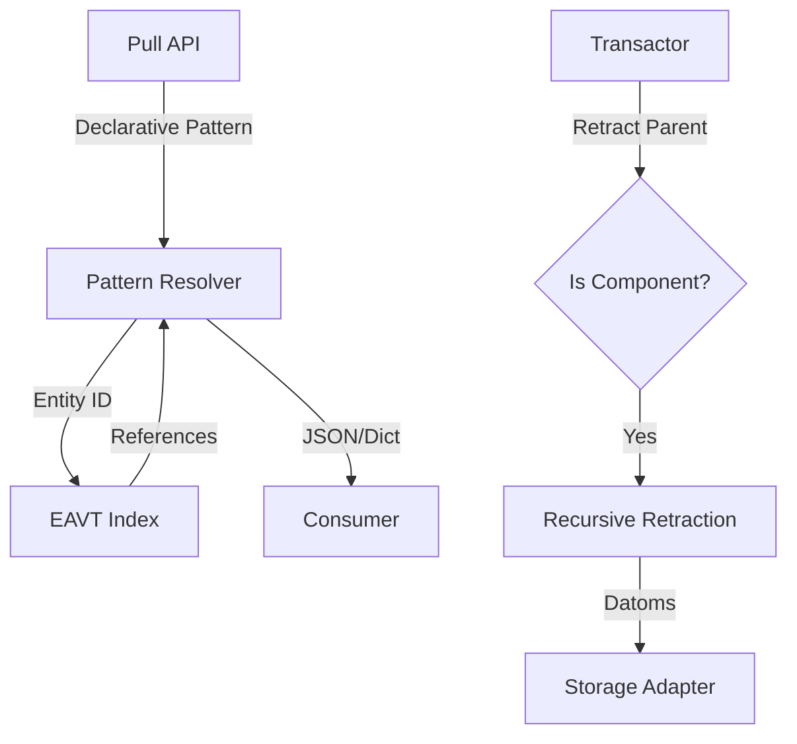

# PRD: Phase 14 - The Sovereign Fabric 🧙🏾‍♂️

**Status**: IMPLEMENTED (Wave 1)
**Priority**: P0
**Owner**: Rich Hickey 🧙🏾‍♂️

## Overview
GleamDB is now "Fast" (120k datoms/sec) and "Correct" (Datalog). However, it is still "Complex" for consumers. Retrieving entities requires manual joins, and auditing historical state is an ad-hoc exercise. **Phase 14** introduces the **Pull API** for de-complected consumption and **Bi-temporality** for absolute historical sovereignty.

## User Stories
- **As a Frontend Developer**, I want to "pull" a nested entity profile (e.g., User -> Posts -> Comments) in a single declarative call so that I don't write complex Datalog for every UI component.
- **As an Auditor**, I want to query the database `as_of` any transaction ID or `since` a point in time to see exactly how the world evolved.
- **As a System Maintainer**, I want to mark certain entities as **Components** so that when I retract a parent, the children are automatically cleaned up (Leaky Abstraction Prevention).

## Acceptance Criteria
### The Pull API
- [ ] GIVEN a database with nested facts (User -> Profile).
- [ ] WHEN I call `gleamdb.pull(db, user_id, ["user/name", {"user/profile": ["profile/bio"]}])`.
- [ ] THEN I receive a nested Gleam `Dict` reflecting the requested shape.
- [ ] PERFORMANCE: Pulling 1000 nested entities must take < 50ms.

### Bi-temporal Time Travel
- [ ] GIVEN a history of transactions.
- [ ] WHEN I query `as_of(db, tx_100)`.
- [ ] THEN the engine ignores all facts with `tx > 100`, providing a pure value-at-time.
- [ ] SUPPORT: `since(db, tx_50)` to see only what changed after tx 50.

### Component Cascades
- [ ] GIVEN an attribute `user/posts` marked as `:is_component`.
- [ ] WHEN I retract the `User` entity.
- [ ] THEN all `Post` entities belonging to that user are retracted in the same transaction.

## Technical Implementation

### Database Schema Changes
- `AttributeConfig` now includes `is_component: Bool`.
- `DbState` indices must support `tx_id` filtering (already present, need optimized scan).

### API
- `gleamdb.pull(db: Db, eid: EntityId, pattern: List(Pattern)) -> Dict(String, Value)`
- `gleamdb.as_of(db: Db, tx: Int) -> Db` (Returns a view-only DB value)

### Visual Architecture

## Pre-Mortem Analysis
**Why will this fail?**
1. **Pull Loops**: Circular references in the Pull pattern could cause infinite recursion and BEAM process death.
   - *Mitigation*: Implementation of a `max_depth` (default 5) and cycle detection in the pattern resolver.
2. **History Bloat**: Keeping every version of every fact makes SQLite/Mnesia grow indefinitely.
   - *Mitigation*: Define a "Sovereign Horizon" (config) beyond which old retracted datoms are vacuumed.

## Phase 20 Retrospective: The Durable Fabric
The Sovereign Fabric has shifted from a pure SQLite-forwarding model to a **Mnesia-native** substrate.
- **Leaders** are registered in the `global` name registry.
- **Followers** monitor the leader PID and use `node.promote_to_leader` for autonomous failover.
- **Persistence** is handles by `gleamdb_mnesia_ffi` for disc-durable fact storage.

---
*Status: Synchronized with Phase 43 reality.*

## Phase 42-43 Retrospective: Sharded Performance & Stability
The Gswarm production cycle revealed that sharding is not just about throughput, but **Recovery Velocity**.
- **Vector Crisis**: $O(N^2)$ scaling in vector indices is fatal for historical replay. NSW search is the mandatory baseline for Sovereign Intelligence.
- **Name Hygiene**: Distributed nodes must minimize `global` registration to avoid startup contention.
- **Parallel Boot**: Shards must initialize concurrently to saturate silicon and minimize time-to-market-readiness.
