# PRD: Sovereign Intelligence Roadmap — Phases 29–33

**Status**: Draft  
**Priority**: P0  
**Owner**: Rich Hickey 🧙🏾‍♂️ (Agentic Conductor)

---

## Overview

Phases 20–28 built the **foundation**: durable fabric, vector indexing, live data ingestion, Alpha-50 analytics, news correlation, and a reinforcement learning loop. The system *accretes facts*. It does not yet *learn from them*.

This roadmap deepens the intelligence stack in five phases, each de-complecting a specific concern:

| Phase | Name | Core Question |
|-------|------|---------------|
| 29 | **Adaptive Strategy Selection** | Which strategy works *right now*? |
| 30 | **Real Vector Read Path** | Can the Analyst see the actual market state? |
| 31 | **Volume & Order Flow Intelligence** | What does real volume tell us that price alone cannot? |
| 32 | **Portfolio Risk Engine** | How much should we risk per signal? |
| 33 | **Temporal Pattern Memory** | 🔮 PLANNED | Can the system recognize what *time of day* patterns repeat? |
| 39-44| **Sovereign Fabric** | ✅ DONE | Sharding, Bloom Filters, & Probabilistic Memory |

```mermaid
graph TD
    A["Phase 28 ✅ Correlation"] --> B["Phase 29: Adaptive Strategy"]
    A --> C["Phase 30: Real Vector Read"]
    B --> D["Phase 32: Portfolio Risk"]
    C --> E["Phase 31: Volume Intel"]
    E --> D
    B --> F["Phase 33: Temporal Memory"]
    D --> G["🎯 Autonomous Alpha"]
    H["Phase 39-44: Fabric ✅"] --> B
    H --> C
```



---

## 1. Deep Assessment (Hostile Auditor)

### Current Gaps

| Gap | Impact | Severity |
|-----|--------|----------|
| `get_latest_vector` returns mock `[0.5, 0.1, 0.5]` | Analyst runs on fake data — all pattern matching is theater | **Critical** |
| Paper Trader hardcoded to `mean_reversion` only | Cannot evaluate `cross_signal` or `trend_follower` live | High |
| No real volume data (hardcoded `100`) | Volume metrics in Alpha-50 are meaningless | High |
| No position sizing / risk limits | A single bad signal can drain the entire paper balance | High |
| No time-of-day awareness | Crypto has recurring patterns at UTC midnight, US open, etc. | Medium |

### The Hostile Auditor Speaks

> "Your correlator stores facts. Your result checker verifies predictions. But your paper trader *ignores both*. The strategy layer has no feedback mechanism. You've built a recording studio but nobody listens to the tapes."

---

## 2. User Stories

- **As a Quant**, I want the paper trader to automatically switch to the highest-performing strategy so that I don't manually babysit allocation.
- **As a Systems Engineer**, I want `get_latest_vector` to return the *real* 50D Alpha vector so the Analyst operates on truth. (COMPLETED)
- **As a Risk Manager**, I want position sizing capped at 2% of portfolio per signal so no single trade can blow the account.
- **As an Analyst**, I want to see per-hour accuracy heatmaps so I can identify when my signals are strongest.

---

## 3. Phase Details

### Phase 29: Adaptive Strategy Selection

**Problem**: Paper Trader uses one hardcoded strategy. The system has data on which strategies *would have* performed best (via `result_fact.gleam`).

**Solution**: A `strategy_selector.gleam` module that:
1. Queries historical prediction accuracy by strategy over a rolling window
2. Selects the strategy with the highest win rate for the current market regime
3. Hot-swaps the paper trader's active strategy

#### Acceptance Criteria

**Given** 100+ result facts with tagged strategy names  
**When** the selector evaluates the rolling 50-prediction window  
**Then** it selects the strategy with the highest win rate  
**And** the paper trader begins using the selected strategy within one tick cycle  

#### Technical Design

```gleam
// strategy_selector.gleam [NEW]
pub fn select_best_strategy(db: Db) -> Strategy
// Queries prediction/result facts, groups by strategy tag, returns highest-accuracy fn

// paper_trader.gleam [MODIFY]
// Accept dynamic strategy via message:
pub type Message {
  TickEvent(price: Float, vector: List(Float))
  SetStrategy(strategy: Strategy)     // HOT SWAP
  GetStatus(reply_to: Subject(State))
}
```

---

### Phase 30: Real Vector Read Path

**Problem**: `market.get_latest_vector/2` is mocked. The `market/latest_vector` fact IS written by `ingest_tick_with_vector`, but never read back.

**Status**: COMPLETED (via Phase 23 Integration)

**Solution**: Implement the read path using `gleamdb.query` instead of `gleamdb.pull`:

```gleam
// market.gleam [MODIFY] — Replace the mock
pub fn get_latest_vector(db: Db, market_id: String) -> Result(List(Float), Nil) {
  let query = [
    types.Positive(#(types.Val(fact.Str(market_id)), "market/id", types.Var("m"))),
    types.Positive(#(types.Var("m"), "market/latest_vector", types.Var("vec")))
  ]
  case gleamdb.query(db, query) {
    [row, ..] -> case dict.get(row, "vec") {
      Ok(fact.Vec(v)) -> Ok(v)
      _ -> Error(Nil)
    }
    _ -> Error(Nil)
  }
}
```

#### Acceptance Criteria

**Given** a market with at least one ingested tick  
**When** `get_latest_vector(db, "m_btc")` is called  
**Then** it returns the *actual* 50D Alpha vector stored by `live_ticker`  
**And** the length of the returned vector equals 50  

---

### Phase 31: Volume & Order Flow Intelligence

**Problem**: `live_ticker` hardcodes `volume = 100`. The Alpha-50 vector's volume metrics (index 11) are all identical.

**Solution**: Either:
- **(A)** Parse volume from the Coinbase API (requires upgrading to the `/products/{id}/ticker` endpoint which includes volume)
- **(B)** Use total trade count as a proxy from `/trades` endpoint

#### Technical Design

```gleam
// live_ticker.gleam [MODIFY]
// Change fetch_price to fetch_ticker, returning #(Float, Int) = #(price, volume_24h)

// analytics.gleam [MODIFY]  
// Add OBV (On-Balance Volume) and VWAP to the base_metrics list
pub fn obv(prices: List(Float), volumes: List(Int)) -> Float
pub fn vwap(prices: List(Float), volumes: List(Int)) -> Float
```

#### Acceptance Criteria

**Given** a live BTC ticker feed  
**When** volume data is ingested  
**Then** `volume_sma(10)` must vary between ticks (not be constant `100.0`)  
**And** OBV must increment/decrement relative to price direction  

---

### Phase 32: Portfolio Risk Engine

**Problem**: Paper Trader goes all-in on every signal (`balance /. price`). No max drawdown protection, no position sizing.

**Solution**: `risk.gleam` module with:
- **Position Sizing**: Kelly Criterion or fixed 2% rule
- **Max Drawdown Stop**: If portfolio drops 10% from peak, halt trading
- **Correlation Gating**: Only trade when correlation signal score exceeds threshold

```gleam
// risk.gleam [NEW]
pub type RiskConfig {
  RiskConfig(
    max_position_pct: Float,    // e.g., 0.02 = 2% per trade
    max_drawdown_pct: Float,    // e.g., 0.10 = 10% halt
    min_signal_score: Float     // Minimum correlator signal to act
  )
}

pub fn size_position(balance: Float, price: Float, config: RiskConfig) -> Float
pub fn check_drawdown(current: Float, peak: Float, config: RiskConfig) -> Bool
```

#### Acceptance Criteria

**Given** a paper trader with $10,000 and `max_position_pct = 0.02`  
**When** a Buy signal triggers at $100,000/BTC  
**Then** the position size must be ≤ $200 (0.002 BTC)  
**And** if drawdown exceeds 10%, all subsequent Buy signals return Hold  

---

### Phase 33: Temporal Pattern Memory

**Problem**: Markets have time-dependent patterns (US open volatility, weekend lulls) that the Alpha-50 vector does not capture.

**Solution**: Add temporal features to the vector:
- Hour-of-day (0–23, normalized to 0.0–1.0)
- Day-of-week (0–6, normalized)
- Time-since-last-news (seconds, normalized)

```gleam
// analytics.gleam [MODIFY]
// Add temporal_features() to calculate_all_metrics
pub fn temporal_features(timestamp: Int) -> List(Float)
// Returns [hour_norm, weekday_norm, seconds_since_midnight_norm]

// Expands Alpha-50 vector to Alpha-53 (or replaces padding slots)
```

#### Acceptance Criteria

**Given** a tick at 14:30 UTC on a Wednesday  
**When** the temporal features are computed  
**Then** hour_norm ≈ 0.604 and weekday_norm ≈ 0.429  
**And** these values appear in the Alpha vector at consistent indices  

---

## 4. Security & Validation

- **Strategy Hot-Swap**: Must be atomic — no half-executed strategy transition
- **Risk Gating**: Cannot be bypassed by any code path — the paper trader MUST call `risk.size_position` before opening any position
- **Input Validation**: Temporal features must clamp to [0.0, 1.0] range regardless of input  

---

## 5. Pre-Mortem: "Why will this fail?"

| Risk | Probability | Mitigation |
|------|-------------|------------|
| **Overfitting**: Adaptive selector chases noise, not signal | High | Minimum 50 predictions before switching; cool-down period between switches |
| **Coinbase API Rate Limiting**: Volume endpoint calls hit 429s | Medium | Implement exponential backoff; cache last-known volume |
| **Temporal Leakage**: Adding hour-of-day creates a look-ahead bias in backtesting | Medium | Backtest engine must reconstruct temporal features from historical timestamps only |
| **Risk Engine Kills All Trades**: Too-conservative settings produce 0 trades | Low | Default config is 2% per trade with 10% drawdown — reasonable for paper trading |

---

## 6. Execution Order (Dependencies)

```
Phase 30 (Read Path)  → Phase 31 (Volume)  → Phase 32 (Risk)
Phase 29 (Adaptive)   → Phase 32 (Risk)
Phase 31 (Volume)     → Phase 33 (Temporal)
```

**Recommended sequence**: 30 → 29 → 31 → 32 → 33

Phase 30 unblocks the entire stack by making the Analyst operate on real data.

---

## Verification Plan

### Automated Tests
```bash
# Build verification for each phase
gleam build

# Run existing test suite
gleam test
```

### Live Verification
- `gleam run` — observe log output for each new module
- Confirm Analyst logs show 50D vectors (not `[0.5, 0.1, 0.5]`) after Phase 30
- Confirm paper trader logs show strategy name changes after Phase 29
- Confirm volume metrics vary after Phase 31

---

PRD Drafted. Initiate the Autonomous Pipeline: `/proceed docs/specs/sovereign_intelligence_roadmap.md -> /test -> /refactor -> /test`
