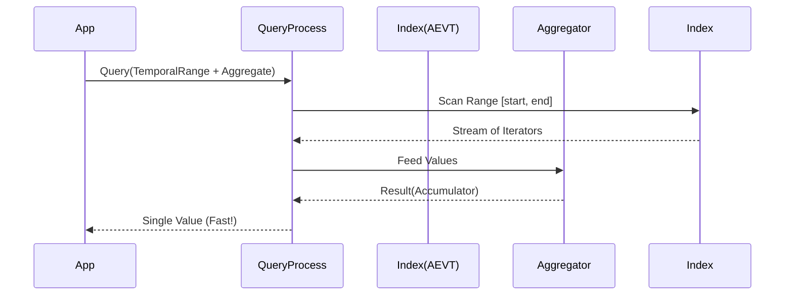

# PRD: Time Series & Analytics Primitives (Phase 23)

## Status
*   **Status**: COMPLETED
*   **Priority**: P0
*   **Owner**: Antigravity (Rich Hickey Persona)
*   **Date**: 2026-02-13

## Overview
GleamDB currently excels at logical inference (Datalog) and vector similarity, but lacks native primitives for efficient time-series analysis. Use cases like Gswarm's prediction markets require pulling massive datasets into application memory to perform simple operations like "get the last 100 probabilities" or "calculate average resolution time". This PRD specifies the addition of optimized temporal query clauses, server-side aggregation, and ordering to de-complect data retrieval from data analysis.

## User Stories

*   **As a** Strategy Algo, **I want** to query the last N price ticks for a market ordered by time, **So that** I can calculate moving averages without fetching the entire history.
*   **As a** Resolution Engine, **I want** to ask the database for the average Brier score of a market, **So that** I don't have to deserialize 10,000 facts to compute a single float.
*   **As a** Data Engineer, **I want** to define retention policies for "tick/*" patterns, **So that** I don't have to manually configure retention for every new prediction market outcome.
*   **As a** Developer, **I want** to enforce that probability values are always between 0.0 and 1.0 at the schema level, **So that** bad data is rejected before it corrupts the immutable log.

## Acceptance Criteria

### Scenario 1: Temporal Pagination
*   **Given** a market with 10,000 ticks,
*   **When** I query `TemporalRange("tick/price", since: t-1hr)` with `Limit(100)` and `OrderBy(:desc)`,
*   **Then** I receive exactly the 100 most recent ticks within that hour window.
*   **And** the query executes in O(log N) or better (leveraging existing indices).

### Scenario 2: Server-Side Aggregation
*   **Given** a set of 50 resolved markets with "brier_score" facts,
*   **When** I query `Aggregate("market/brier_score", :avg)`,
*   **Then** I receive a single float value representing the mean.
*   **And** no individual fact attributes are returned to the client.

### Scenario 3: Top-K Vector Search
*   **Given** 100,000 markets with semantic embeddings,
*   **When** I query `SimilarityTopK("market/vector", target_vec, 5)`,
*   **Then** I receive only the top 5 matches based on Cosine Similarity.
*   **And** the engine optimizes the scan to avoid full sort if possible.

## Technical Implementation

### 1. Extended Query Domain (Types)
We will extend the `gleamdb/types` module to support new clause constraints.

```gleam
pub type QueryClause {
  // ... existing clauses ...
  
  // New: Temporal & Ordering
  TemporalRange(attr: String, since: Int, until: Int)
  Limit(n: Int)
  Offset(n: Int)
  OrderBy(attr: String, direction: OrderDirection)
  
  // New: Aggregation
  Aggregate(attr: String, op: AggOp, alias: String)
  GroupBy(attr: String)
  
  // New: Optimization
  SimilarityTopK(attr: String, target: List(Float), k: Int)
}

pub type AggOp {
  Avg
  Sum
  Count
  Min
  Max
}

pub type OrderDirection {
  Asc
  Desc
}
```

### 2. Schema Validation (Write Path)
We will introduce a `SchemaConstraint` type to the `Context` module.

```gleam
pub type Constraint {
  FloatRange(min: Float, max: Float)
  IntRange(min: Int, max: Int)
  StringEnum(allowed: List(String))
  RegexPattern(pattern: String)
}

// Stored in metadata e.g., "schema/constraint/tick/probability" -> FloatRange(0.0, 1.0)
```

**Data Flow**:
1.  `transact(db, facts)` called.
2.  `validate_batch(facts, schema)` runs before WAL write.
3.  If any fact violates a constraint, the *entire transaction* is rejected.

### 3. Wildcard Retention
Update `gleamdb/context.gleam`: `configure_retention` will support `*` suffix matching.
*   Index: `schema/retention_policy/tick/*` -> `Latest(1)`
*   Logic: When checking retention, check exact match first, then prefix match.

## Data Flow Diagram (Conceptual)


## Security & Validation
*   **Auth**: No changes to auth (GleamDB is embedded/internal).
*   **DoS Prevention**: `Limit` is mandatory for `TemporalRange` queries without `Aggregate` to prevent unexpected memory exhaustion.
*   **Type Safety**: Aggregation ops must match attribute types (e.g., `Avg` on `Str` returns Error).

## Pre-Mortem Analysis
*   **Failure Mode**: `OrderBy` on non-indexed attribute.
    *   **Mitigation**: Return error if attribute is not in AEVT/AVET index. Sort must utilize index for speed.
*   **Failure Mode**: Recursive aggregation (aggregating over derived Datalog rules).
    *   **Mitigation**: Version 1 only supports aggregation over *extensional* (stored) facts, not intensional (derived) ones.
*   **Failure Mode**: Memory spike during `GroupBy`.
    *   **Mitigation**: Streaming reduction. We do not materialize groups; we fold over the stream.

## Migration (Data)
*   No migration needed for existing data.
*   New schema constraints apply only to *new* writes.

## Verification Plan
1.  **Unit Tests**: Test `TemporalRange` boundary conditions (inclusive/exclusive).
2.  **Property Tests**: Generate random fact streams and verify `Aggregate` matches `list.fold`.
3.  **Benchmark**: Compare `get_probability_series` (old) vs `TemporalRange` query (new) on 100k ticks.
