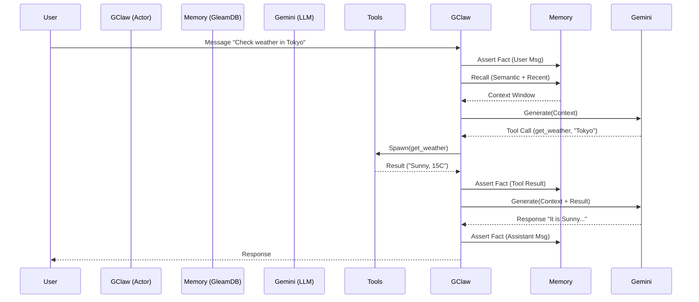

# OpenClaw Gleam Implementation (GClaw)

**Status**: Draft / In-Progress
**Priority**: P0
**Owner**: Brix Electronics / Antigravity
**Version**: 0.2.0 (Post-Phase 2)

## Overview
GClaw is a minimalist, type-safe reimplementation of the OpenClaw autonomous agent framework in Gleam. It leverages **GleamDB** for a "Context Sovereign" memory model, treating agent state as an immutable pool of facts rather than a monolithic session object. It is optimized for the **Gemini-1.5-Flash** model, utilizing its long context window and speed for reasoning.

## Gap Analysis (Current vs. Vision)

The following analysis compares the current GClaw v0.2.0 implementation against the full OpenClaw vision.

| Feature Area | Current State (v0.2.0) | OpenClaw Vision | Gap / Debt |
| :--- | :--- | :--- | :--- |
| **Memory Model** | Fact-based (EAVT), simple session isolation. | Sovereign Graph with derived facts and temporal reasoning. | Missing derived fact engine (inference rules). |
| **Persistence** | Append-only binary disk log (`disk.gleam`). | Robust, compacted log with snapshotting. | Log rotation and compaction are missing. |
| **Vector Search** | `mem/vector` attribute exists; query logic exists. | **Active Semantic Recall**: Auto-embedding input and retrieving relevant past facts. | **Critical**: No embedding generation integration. |
| **Tool Execution** | Synchronous, sequential loop. | **Parallel/Async**: Concurrent tool execution via Actors. | Tools block the main loop; no concurrency. |
| **Context Mgmt** | Hard `limit` on message count. | **Token-Aware Lifecycle**: Summarization at threshold (80%). | No token counting or background summarization. |
| **Multi-Modal** | Text-only. | Native Image/Video understanding. | Input pipeline is text-only. |

## User Stories
- **As a developer**, I want a type-safe agent runtime so that I can reliably extend capabilities on the BEAM without runtime crashes.
- **As a user**, I want an agent that remembers my preferences across sessions via semantic search, not just recent history.
- **As a system**, I want to execute multiple tools in parallel (e.g., fetch weather + check calendar) to reduce latency.

## Roadmap & Execution Protocol

### Phase 3: Semantic Foundation (The "Brain" Upgrade) 🧠
**Goal**: bridge the gap between "storing" vectors and "using" them.
- [ ] **Embedding Service**: Integrate `gemini-embedding-001` or compatible provider.
- [ ] **Auto-Vectorization**: Middleware to automatically embed incoming `msg/content` and store as `mem/vector`.
- [ ] **Semantic Retrieval Hook**: Update `get_context_window` to mix recent messages (time-based) with relevant past messages (vector-based).

### Phase 4: Concurrency & Tools (The "Hands" Upgrade) 👐
**Goal**: Make the agent non-blocking and faster.
- [ ] **Actor-Based Tools**: Refactor tool execution to spawn ephemeral Gleam processes.
- [ ] **Parallel Orchestrator**: Update `gclaw.gleam` to gather tool results asynchronously.
- [ ] **Tool Registry**: Dynamic registration of tools instead of hardcoded lists.

### Phase 5: Context Lifecycle (The "Memory" Upgrade) 💾
**Goal**: Infinite *effective* memory via summarization.
- [ ] **Token Counter**: Implement a rough tokenizer (approximate) for Gemini.
- [ ] **Compaction Actor**: Background process that wakes up when context > 80%.
- [ ] **Summarization Skill**: Recursive prompt to summarize old messages into `mem/summary` facts.

### Phase 6: Multi-Modal & Derived Facts 👁️
**Goal**: Full sensory awareness.
- [ ] **Image Ingest**: Support base64 or URL image inputs in `msg/content`.
- [ ] **Fact Derivation Rules**: Datalog rules to infer "User Location" or "User Mood" from raw messages.

## Technical Implementation

### Database Schema (GleamDB)
| Attribute | Type | Description |
|-----------|------|-------------|
| `msg/content` | Str | Raw text of the message |
| `msg/role` | Str | user, assistant, system, tool |
| `msg/session` | Str | Session identifier (for grouping) |
| `msg/timestamp` | Int | Unix timestamp |
| `mem/summary` | Str | Summarized knowledge |
| `mem/vector` | Vec | Float vector for semantic search |
| `tool/call` | Str | JSON tool call payload |
| `tool/result` | Str | Result of the tool execution |

### Visual Architecture (Sequence)

## Pre-Mortem Analysis
- **Failure Mode 1**: **Context Bloat**. Without compaction, long sessions will hit Gemini's limit or degrade performance. *Mitigation*: Phase 5 is critical.
- **Failure Mode 2**: **Vector Drift**. Embeddings from different models (or updated models) might not match. *Mitigation*: Version vectors or stick to one embedding model per "memory realm".
- **Failure Mode 3**: **Tool Hallucination**. Gemini might call non-existent tools. *Mitigation*: Strict schema validation in the JSON decoding layer (implemented in Phase 2).

---
*Generated by Antigravity via Sly/Hickey Protocol*
