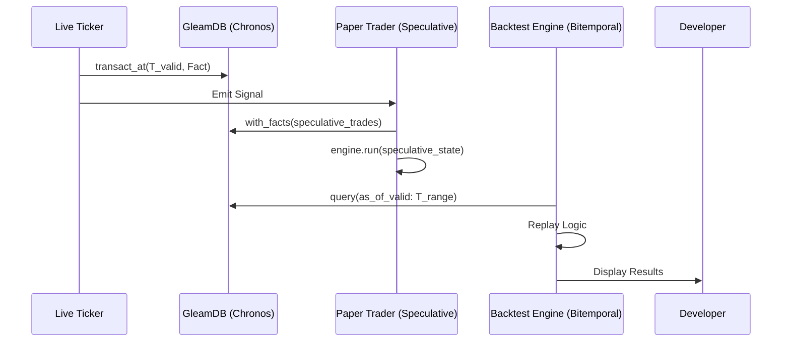

# PRD: Backtesting & Paper Trading Engine

**Status**: Draft
**Priority**: P0
**Owner**: Rich Hickey (Architect)

## Overview
Gswarm currenty ingests real-time "Alpha" vectors (Volatility, Trend). We need to close the loop by:
1. **Backtesting**: Replaying historical vectors through a strategy function to calculate theoretical PnL.
2. **Paper Trading**: Executing strategy decisions in-memory against live price feeds to validate real-time performance.
3. **High-Dimensional Analytics**: Expanding the Alpha vector from 3 to 50+ metrics to provide the AI Analyst with richer features for pattern matching.

## User Stories
- **As a Quant**, I want to replay the last 7 days of SOL market movements through my 'Momentum' strategy so that I can see its Sharpe ratio.
- **As a Developer**, I want to run a 'Paper Trader' agent that logs buy/sell signals without risking real capital.
- **As an Analyst**, I want the market state to include deep volume and momentum metrics to improve similarity searching.

## Acceptance Criteria
### Backtesting (Simulation)
- **Given** a historical range of Ticks in GleamDB.
- **When** the Backtest engine is run with a Strategy function.
- **Then** it must produce a `BacktestResult` containing total return, drawdown, and win rate.
- **Failure Path**: If data is missing or gapped, the engine must warn or interpolate rather than producing false stats.

### Paper Trading (Reality Simulation)
- **Given** a live stream of Ticks from `live_ticker`.
- **When** the `paper_trader` actor receives a tick.
- **Then** it must update its virtual wallet if the strategy triggers a trade.
- **Then** it must log the "Slippage" (difference between signaled price and simulated fill).

### Technical Implementation

#### Bitemporal Accuracy (Chronos)
We leverage GleamDB v2.0 **Chronos** to separate "Transaction Time" (when we record) from "Valid Time" (when the market event occurred). This eliminates look-ahead bias by querying `as_of_valid(T)` to ensure the strategy only sees what was known at simulation time $T$.

#### Speculative Execution (Speculative Soul)
The `paper_trader` uses `with_facts` to create ephemeral state forks. This allows the trader to simulate trades, calculate "What-if" portfolio impacts, and run PageRank based influence scans on the speculative state without polluting the durable store.

### Visual Architecture

## Security & Validation
- **Sandboxing**: Paper trading actors MUST NOT have access to real exchange keys.
- **Input Validation**: Strategy functions must be total (handling all vector inputs without crashing).

## Pre-Mortem: Why will this fail?
- **Look-ahead Bias**: The backtester might accidentally use "future" metrics to make past decisions.
- **Garbage In/Garbage Out**: If the 50 metrics are highly correlated, the AI Analyst will find "ghost patterns".
- **Mitigation**: Pure strategy functions that only accept the *current* vector.

---
PRD Drafted. Initiate the Autonomous Pipeline: /proceed docs/specs/backtesting_and_paper_trading.md -> /test -> /refactor -> /test
