# PRD: Insider Alpha & Micro-Copytrading 🕵️‍♂️💸

**Status**: Draft (Approved Objective)  
**Priority**: P0  
**Owner**: Rich Hickey 🧙🏾‍♂️ (Agentic Conductor)

## Overview
Gswarm's sole purpose is now to identify "Insider Alpha"—traders who consistently execute trades *before* significant probability shifts in prediction or crypto markets. We will verify their competence through Lead-Time Correlation and deploy a Micro-Copytrading engine optimized for $10 capital, ensuring stable, fee-resistant returns.

---

## 1. User Stories
- **As a System Analyst**, I want to detect traders whose buys occur < 5 mins before a >10% probability spike so I can flag them as "Suspected Insiders."
- **As a Quant**, I want to verify a trader's "Competence Score" over 20+ markets to ensure their alpha is systemic, not situational.
- **As a Small Investor**, I want a copytrading strategy that works with $10 capital by optimizing for high-liquidity markets and minimizing execution lag.

---

## 2. Acceptance Criteria (Rich Hickey Gherkin)

### Path: Insider Detection
**Given** a market with a +20% probability shift at `T=100`  
**When** a trader purchased a "Yes" position at `T=95`  
**Then** the "Lead-Time Lag" is recorded as -5 minutes  
**And** their "Insider Confidence" score increases if this pattern repeats >3 times.

### Path: $10 Copytrading
**Given** a $10 paper-trading balance  
**When** a "Verified Insider" executes a trade  
**Then** Gswarm must execute a mirrored trade within 200ms  
**And** the trade must only be executed if the expected ROI covers the simulated spread and keeps the capital >$10.

---

## 3. Technical Implementation

### Database Schema Evolution
- **Insider Fact**: `#(trader_id, "insider/lag_avg", float_mins)`
- **Insider Fact**: `#(trader_id, "insider/confidence", float_score)`
- **Copytrade Fact**: `#(copytrade_id, "execution/slippage", float_usd)`

### Global Search & Analytics
- **Lead-Time Engine**: Analyzes the delta between `TradeActivity.timestamp` and the next `Tick.probability` inflection point.
- **Coordinated Detection (v2.0)**: Uses the GleamDB **Graph Suite** (`q.cycle_detect`, `q.strongly_connected_components`) to identify rings of traders that coordinate entries to signal alpha to each other.
- **Competence Filter**: A weighted average of:
    - Brier Score (Accuracy) — Optimized via **Navigator** for sharded history scans.
    - Lead-Time Lag (Insider Signal)
    - Global Confidence — Aggregated across all shards using **Sovereign Intelligence** (`q.avg`).

---

## 4. Visual Architecture

```mermaid
graph TD
    A["Raw Ticks (Live Feed)"] --> B["Inflection Point Detector"]
    C["Trade Activity (Insiders)"] --> D["Lead-Time Analyzer"]
    B --> D
    D --> E["Competence Verifier"]
    E --> F["$10 Copytrading Engine"]
    F --> G["Stable Returns 📈"]
```

---

## 5. Pre-Mortem: "Why will this fail?"
- **The "Oracle Problem"**: We might find traders who are just bots reacting to the same signal we see. 
    - *Mitigation*: Look for "First-Mover" advantage (lowest latency to event).
- **Liquidity Trap**: Copying a $100k trade with $10 into a thin market results in instant 5% loss on spread.
    - *Mitigation*: Filter insiding signals by market depth/liquidity facts.

---

## 6. Future Mandate
All future phases (Phase 52+) must strictly serve this Alpha extraction loop. No "general" features allowed unless they improve Insider Detection or Execution Stability.

---

PRD Drafted. Initiate the Autonomous Pipeline: `/proceed docs/specs/insider_alpha_copytrade.md -> /test -> /refactor -> /test`
