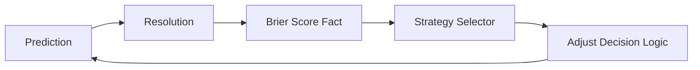

# PRD: Self-Correction Loop (Phase 51) 🔄🧠

**Status**: COMPLETED  
**Priority**: P0 (Intellectual Foundation)  
**Owner**: Rich Hickey 🧙🏾‍♂️

## Overview
"Learning happens in the gap between what we expected and what occurred." Gswarm currently records `result_fact` and Brier scores, but the `analyst` and `strategy_selector` only look at win-rates. **Phase 51** implements a **Self-Correction Loop** where the swarm uses its own calibration history to penalize overconfident (but lucky) signals and reward well-calibrated (even if lower frequency) signals. This has been expanded into the **Semantic Reflexion Loop** (Phase 52), enabling autonomous self-healing via Gemini 2.5 Flash.

---

## 1. Deep Assessment (Rich Hickey Analysis)
- **Constraint**: Avoid "Calibration Death" where the system becomes too afraid to predict.
- **Mechanism**: The `strategy_selector` should weigh Brier Scores (lower is better) alongside Win Rate.

---

## 2. User Stories
- **As a Stakeholder**, I want the swarm to automatically "shut up" if its recent calibration score is poor, preventing blind trading into high-uncertainty regimes.

---

## 3. Acceptance Criteria (Rich Hickey Gherkin)
### Path: Calibration Weighting
**Given** Strategy A (Win Rate 60%, Brier 0.25) and Strategy B (Win Rate 55%, Brier 0.10)  
**When** the selector evaluates the next period  
**Then** Strategy B should be prioritized if the "Calibration vs Gain" bias is set to Wisdom.

---

## 4. Technical Implementation

### Logic: `strategy_selector.gleam` [MODIFY]
- Query `calibration_fact` stores. Use the **Navigator** cost-based planner to optimize retrieval of historical Brier scores across sharded history.
- Leveraging **Chronos** (valid-time semantics), ensure the wisdom score is computed against the *exact* valid-time regime of the prediction, preventing temporal drift in calibration scoring.
- Implement a `wisdom_score = win_rate *. (1.0 - brier_score)`.
- Use this score for the hot-swap decision.

---

## 5. Visual Architecture

---

## 6. Pre-Mortem: "Why will this fail?"
- **Historical Echo**: Calibration lags. By the time we know we were wrong, the market regime has changed.
  - *Mitigation*: Use a very short window (10-20 predictions) for the "Confidence Brake" and a longer window for "Strategy Selection."

---

PRD Drafted. Initiate the Autonomous Pipeline: /proceed docs/specs/self_correction_loop.md -> /test -> /refactor -> /test
