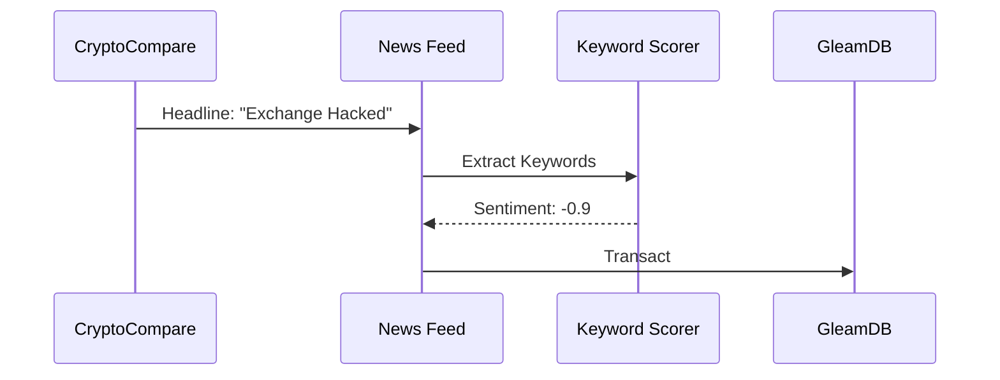

# PRD: Sentiment-Aware Context (Phase 49) 📰🧠

**Status**: COMPLETED  
**Priority**: P1  
**Owner**: Rich Hickey 🧙🏾‍♂️

## Overview
Gswarm currently ingests news headlines via `news_feed.gleam`, but the "vectorization" is a mocked deterministic hash of the title. This provides no real semantic insight. **Phase 49** de-complects "headline storage" from "sentiment perception," enabling the Analyst to act on the *meaning* of news (Bullish/Bearish/Neutral) rather than just the *presence* of it.

---

## 1. Deep Assessment (Rich Hickey Analysis)
- **Constraint**: Local-first. We cannot call an expensive LLM API for every headline if we want to remain "Sovereign."
- **Alternative**: Keyword-based sentiment scoring or a lightweight local NIF (if available).
- **Schema Impact**: `news/vector` should represent a normalized sentiment score.

---

## 2. User Stories
- **As an Analyst**, I want news items to be tagged with a sentiment score (-1.0 to 1.0) so that I can correlate market movements with news bias.
- **As a Quant**, I want the Alpha vector to include a "News Sentiment" slot so my strategy can filter for "High Sentiment Volatility."

---

## 3. Acceptance Criteria (Rich Hickey Gherkin)
### Path: News Ingestion
**Given** a headline containing "Bitcoin ETFs approved"  
**When** the news is ingested  
**Then** `news/sentiment` must be > 0.5 (Bullish)  
**And** `news/vector` must reflect this positive bias.

---

## 4. Technical Implementation

### Database
- **New Fact**: `#(news/id, "news/sentiment", fact.Float(Score))`
- **Update**: `news/vector` now contains the sentiment score in its first slot.

### Logic: `news_feed.gleam`
- Implement a `keyword_scorer` that recognizes common financial terms (Approved, Rejected, Hack, Bull, Bear).
- Normalize scores to `[-1.0, 1.0]`.
- Leverage GleamDB v2.0 **Sovereign Intelligence** (`q.avg`) to perform high-performance aggregate scans over sentiment vectors across multiple shards to identify global market bias.

---

## 5. Visual Architecture

---

## 6. Pre-Mortem: "Why will this fail?"
- **Sarcasm/Complexity**: A simple keyword scorer misses nuance (e.g., "Not as Bearish as expected").
  - *Mitigation*: Keep it simple for simulation; label it as "Heuristic Sentiment."

---

PRD Drafted. Initiate the Autonomous Pipeline: /proceed docs/specs/sentiment_aware_context.md -> /test -> /refactor -> /test
