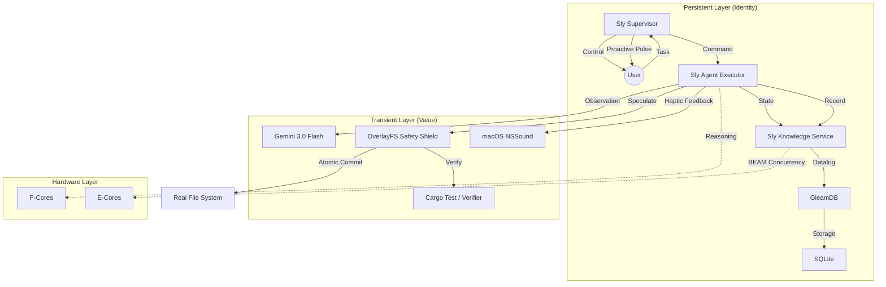

# Architecture: Sly v0.6.0 (Godmode & Direct)

## Core Philosophy: "Maximum Intelligence, Zero Vulnerabilities"

Sly operates as a **high-velocity, SecOps-hardened cybernetic organism** optimized for Apple Silicon. We follow the **Hickey Strategic Doctrine** (Simplicity & Decomplection) to build the "Vim of Agents."

**v0.6.0 Update**: We have transitioned to a **Data-Oriented Architecture**, replacing complex adapter registries with a unified `AgentIO` trait and eliminating runtime specifications in favor of compiled Rust types.

### Strategic Foundation (The Hickey Lens)

1. **Temporal Decoupling**: The **Cortex** is a pure conduit. Its role is routing, not execution. By separating impulse reception from execution handlers, we eliminate temporal braiding.
2. **Identity vs. Value**: **OverlayFS** treats the filesystem as a sequence of immutable snapshots. Every speculative action yields a new "Value" of the codebase, leaving the process "Identity" untangled.
3. **Data-Orientation**: All internal engine communication occurs via **Impulses** (Enums). We prioritize unentangled variants over complex object taxonomies.
4. **Vim Philosophy**: Composition over Monoliths. We transform data through direct handler functions: `Impulse -> Action`.
5. **De-complecting Persistence**: Formal separation of **Logic** (Datalog) from **Storage** (RocksDB). By introducing an **Ephemeral Mode** (`:memory:`), we allow the OODA loop to act as a pure function on code-values without being blocked by a global process lock.
6. **Workflow Discovery**: Composition over fixed menus. The Supervisor dynamically discovers routines in `.agent/workflows/`, allowing the agent's capabilities to evolve as data files rather than code changes.

## Component Breakdown

### 0. `Cortex` (The Nervous System)

- **Role**: Event-Driven Coordination & QoS with **Variable Thinking**.
- **Implementation**:
  - **QoS**: Biased `tokio::select!` loop with dual channels (`Priority` vs `Background`).
  - **Haptics**: Integration with native macOS sound system (`afplay`) for real-time auditory status updates.
  - **Reasoning**: `ThinkingLevel` enum controls Gemini 2.5/3.0 effort (High/Low/Minimal).
- **v0.6.0 Hardening**: System instructions are resident in the Cortex, enforcing the "Godmode" identity across all sessions.
- **Unified I/O**: The Cortex now polls a polymorphic `Box<dyn AgentIO>` trait, allowing it to be driven by CLI (stdin/stdout) or Telegram (webhooks) using the exact same logic loop.

### 1. `OverlayFS` (The Safety Shield)

- **Role**: Transactional Filesystem Isolation ("Speculative Execution").
- **Location**: `src/safety/overlay.rs`.
- **Logic**: All `WriteFile` directives target a Copy-on-Write overlay. No changes reach the real filesystem without a `Commit` after passing the **Crucible** (verification tests).

### 2. `Memory` (The Sovereign Knowledge Service)

- **Role**: Graph-Guided State Management & Heuristic Recall via **GleamDB**.
- **De-complecting Strategy**: 
  - **Sovereign Service**: The memory layer is no longer embedded. It lives in `sly_knowledge`, a standalone BEAM process that communicates with the Rust agent via standardized data-pipes (JSON IPC).
  - **Datalog Advantage**: Leveraging recursive rules for high-speed dependency graph traversal.
  - **De-complecting Search**: Search is no longer a Datalog problem; it is delegated to a native **SQLite FTS5** trigram index, providing sub-second semantic lookups across millions of symbols.
- **Cognition**: **Heuristic Persistence** allows the agent to store and recall specialized technical patterns. By separating the mind (BEAM) from the body (Rust), we achieve fault isolation and concurrent scaling.
- **Efficiency**: Exploits BEAM's actor model and **Atomic Batch Ingestion** (persist-batch protocol) to achieve ~55x higher throughput during codebase scans.

### 3. `Reflexion` & `SystemMcp` (The Recursive Engine)

- **Role**: Recursive Error Correction & Task Decomposition.
- **Logic**:
  - **Reflexion**: Intercepts non-zero exit codes.
  - **Recursion**: The `sly_run_task` tool allows the agent to spawn isolated sub-processes of itself (`Command::new("sly")`).
  - **Self-Evolution**: The `sly_evolve` tool permits the agent to write new code, verify it via `cargo check`, and signal a restart to upgrade its own binary.

### 4. `MCP Ecosystem` (Sovereign & Pluggable)

- **Implementation**: Internal registry in `src/mcp/` using the `LocalMcp` trait.
  - **Auto-Discovery**: Dynamic scanning of `~/.sly/mcp/` for executable providers.
  - **UKR**: Broadcast search orchestration across all registered clients.
  - **Chaining**: Stateful result persistence in `CozoDB` (`last_action_result`) allows data-piping between turns.
  - **Native Tools**: `browser` (headless_chrome), `cloud` (wrangler/aws), and `fetch` (lightweight reqwest).
- **Safety**: Tools are subject to the same **OverlayFS** Speculative Safety rules as the core engine.

### 5. `The Sentinel` (Security Gate)

- **Role**: Automated Linting & Safety Audits.
- **Tools**: `cargo clippy` and persona-based **Debates**.

### 5. `The Supervisor` (Identity Guard)

- **Role**: Process Persistence & Remote Control.
- **Implementation**:
  - **Control Plane**: Unified Telegram loop for task initiation and management.
  - **Predictive Pulse**: Proactive background analysis of `TASKS.md` and codebase state during idle cycles (every 5 mins).
  - **Persistence**: Single-binary execution with PID-aware locking (`.sly/supervisor.lock`).
