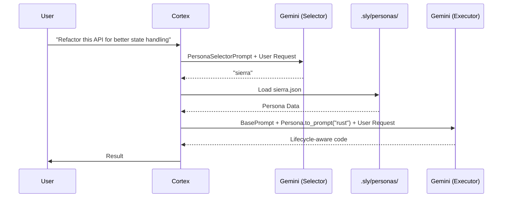

# PRD: Persona-Based Code Generation

- **Status**: Draft
- **Priority**: P0
- **Owner**: RichHickey 🧙🏾‍♂️

---

## Overview

Sly shall adopt specialized architectural personas based on task domain. Each persona is **Pure Data**: a set of directives (positive rules) and constraints (negative rules) generalized across all programming languages. The agent **reflexively selects** the appropriate persona by reasoning about the user's intent.

> "It is better to have 100 functions operate on one data structure than 10 functions on 10 structures."

The personas are not code. They are **values**. Data in, data out.

---

## User Stories

1. **As a System Architect**, I want Sly to reject global mutable state so my systems remain simple.
2. **As a UI Developer**, I want "Single Source of Truth" principles applied to React/Vue without Clojure.
3. **As a Debugger**, I want Sly to demand a reproduction before offering a fix.
4. **As a Performance Engineer**, I want Sly to reject sequential accumulators for parallel operations.

---

## Acceptance Criteria

### Success Path
```gherkin
Given a task involving "distributed state management"
When Sly evaluates the task context
Then it selects the "Stuart Sierra" persona
And generates code with explicit start/stop lifecycles
And rejects global mutable state.
```

### Failure Path
```gherkin
Given a request "Fix this bug" without logs
When the "Stuart Halloway" persona is active
Then Sly refuses to provide a fix
And outputs a "Reproduction Script" requirement.
```

---

## Technical Implementation

### 1. Persona Data Structure (Language-Agnostic)

Personas are stored as **JSON** in `.sly/personas/`. No database needed. File-based simplicity.

```json
// .sly/personas/hickey.json
{
  "id": "hickey",
  "name": "Rich Hickey (The Simplifier)",
  "domains": ["architecture", "state", "concurrency"],
  "directives": [
    "Prefer immutable data structures",
    "Separate identity from value",
    "Use generic data (maps, vectors) over custom types",
    "Decouple policy from mechanism"
  ],
  "constraints": [
    "Never use global mutable state",
    "Never complect time with value",
    "Never inherit when composition suffices",
    "Never use locks when STM/channels suffice"
  ],
  "language_mappings": {
    "rust": {
      "immutability": "Use `&self` over `&mut self`. Prefer `Clone` over interior mutability.",
      "state": "Use `Arc<Mutex<T>>` sparingly. Prefer message-passing with `tokio::sync::mpsc`."
    },
    "javascript": {
      "immutability": "Use `const` and spread operators. Prefer Immer or Immutable.js.",
      "state": "Single atom pattern. Avoid scattered `useState` for business logic."
    },
    "python": {
      "immutability": "Use `@dataclass(frozen=True)`. Prefer `tuple` over `list` for fixed data.",
      "state": "Use dependency injection. Avoid module-level mutable variables."
    }
  }
}
```

### 2. Persona Registry (`src/core/persona.rs`)

```rust
// NEW FILE: src/core/persona.rs

use serde::{Deserialize, Serialize};
use std::collections::HashMap;
use std::path::Path;

#[derive(Debug, Clone, Serialize, Deserialize)]
pub struct Persona {
    pub id: String,
    pub name: String,
    pub domains: Vec<String>,
    pub directives: Vec<String>,
    pub constraints: Vec<String>,
    pub language_mappings: HashMap<String, HashMap<String, String>>,
}

impl Persona {
    /// Generates the prompt fragment for this persona
    pub fn to_prompt(&self, target_lang: &str) -> String {
        let mut prompt = format!("### Active Persona: {}\n\n", self.name);
        
        prompt.push_str("**Directives (DO):**\n");
        for d in &self.directives {
            prompt.push_str(&format!("- {}\n", d));
        }
        
        prompt.push_str("\n**Constraints (DO NOT):**\n");
        for c in &self.constraints {
            prompt.push_str(&format!("- {}\n", c));
        }
        
        if let Some(lang_map) = self.language_mappings.get(target_lang) {
            prompt.push_str(&format!("\n**{} Specifics:**\n", target_lang));
            for (concept, guidance) in lang_map {
                prompt.push_str(&format!("- *{}*: {}\n", concept, guidance));
            }
        }
        
        prompt
    }
}

pub fn load_personas(personas_dir: &Path) -> anyhow::Result<Vec<Persona>> {
    let mut personas = Vec::new();
    for entry in std::fs::read_dir(personas_dir)? {
        let path = entry?.path();
        if path.extension().map_or(false, |e| e == "json") {
            let content = std::fs::read_to_string(&path)?;
            let persona: Persona = serde_json::from_str(&content)?;
            personas.push(persona);
        }
    }
    Ok(personas)
}
```

### 3. Persona Selector (Reflexive, Not Hardcoded)

The Cortex does **not** use keyword matching. Instead, we inject a **meta-prompt** asking Gemini to select the persona:

```rust
// In src/core/cortex.rs (modification)

const PERSONA_SELECTOR_PROMPT: &str = r#"
You have access to the following expert personas. Analyze the user's request and select the MOST appropriate persona ID. Output ONLY the persona ID on a single line, nothing else.

Available Personas:
- hickey: Architecture, simplicity, state management, concurrency.
- sierra: Large-scale systems, lifecycle management, dependency injection.
- nolen: UI/Frontend, immutable state, reactive rendering.
- halloway: Debugging, scientific method, generative testing.
- steele: Parallelism, associativity, monoids, high-performance computing.
- kay: Biological systems, message-passing, late binding, actors.

User Request: {user_request}

Selected Persona ID:
"#;
```

### 4. Data Flow



### 5. Cortex Integration

```rust
// Modification to src/core/cortex.rs

async fn process_impulse(&mut self, impulse: Impulse) -> Result<Action> {
    // Step 1: Select Persona (if not already set for session)
    let persona = if self.active_persona.is_none() {
        let selector_prompt = PERSONA_SELECTOR_PROMPT
            .replace("{user_request}", &impulse.content());
        let persona_id = self.gemini.generate_simple(&selector_prompt).await?;
        let personas = load_personas(&self.personas_dir)?;
        personas.into_iter().find(|p| p.id == persona_id.trim())
    } else {
        self.active_persona.clone()
    };
    
    // Step 2: Construct System Prompt
    let target_lang = detect_language(&impulse); // e.g., "rust"
    let persona_fragment = persona
        .as_ref()
        .map(|p| p.to_prompt(target_lang))
        .unwrap_or_default();
    
    let system_prompt = format!(
        "{}\n\n{}", 
        self.base_godmode_prompt, 
        persona_fragment
    );
    
    // Step 3: Execute
    self.gemini.generate_with_system(&system_prompt, &impulse.content()).await
}
```

---

## Security & Validation

> [!CAUTION]
> **Invariant Shield**: Persona fragments are appended AFTER the core safety instructions. They CANNOT override:
> - OverlayFS commit rules
> - Sentinel linting
> - API key redaction

- **Auditing**: Persona selection is logged to CozoDB for drift detection.
- **Validation**: Persona JSON files are validated on load (schema check).

---

## Corner Cases

| Case | Resolution |
|------|------------|
| Ambiguous task | Default to `hickey` (the root philosophy) |
| No persona match | Use base Godmode prompt (no persona fragment) |
| Language not in mapping | Use directives/constraints only (general guidance) |

---

## Pre-Mortem: "Why Will This Fail?"

1. **Token Overhead**: Each persona adds ~200 tokens.
   - *Mitigation*: Cache active persona for session, summarize mappings.
2. **Selector Errors**: Gemini picks wrong persona.
   - *Mitigation*: Allow user override via `!persona hickey` command.
3. **Conflicting Philosophies**: Kay wants late binding, Steele wants algebraic rigor.
   - *Mitigation*: Only ONE persona active per impulse. No blending.

---

## Verification Plan

### Automated Tests
```bash
cargo test --package sly --lib -- core::persona::tests
```

### Manual Verification
1. Send "Fix this bug" → Expect Halloway persona, reproduction demand.
2. Send "Parallelize this loop" → Expect Steele persona, monoid guidance.
3. Send "Add a button to the dashboard" → Expect Nolen persona, single-atom state.

---

## Proposed Changes

### [NEW] [hickey.json](file:///Users/brixelectronics/Documents/mac/sly/.sly/personas/hickey.json)
### [NEW] [sierra.json](file:///Users/brixelectronics/Documents/mac/sly/.sly/personas/sierra.json)
### [NEW] [nolen.json](file:///Users/brixelectronics/Documents/mac/sly/.sly/personas/nolen.json)
### [NEW] [halloway.json](file:///Users/brixelectronics/Documents/mac/sly/.sly/personas/halloway.json)
### [NEW] [steele.json](file:///Users/brixelectronics/Documents/mac/sly/.sly/personas/steele.json)
### [NEW] [kay.json](file:///Users/brixelectronics/Documents/mac/sly/.sly/personas/kay.json)
### [NEW] [persona.rs](file:///Users/brixelectronics/Documents/mac/sly/src/core/persona.rs)
### [MODIFY] [cortex.rs](file:///Users/brixelectronics/Documents/mac/sly/src/core/cortex.rs)

---

PRD Drafted. Initiate the Autonomous Pipeline: `/proceed docs/specs/persona_code_gen.md` -> `/test` -> `/refactor` -> `/test`
